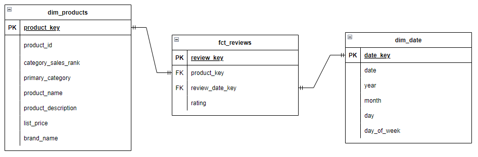

# Amazon Reviews Data Warehouse (DWH) - Case Study Solution

## Overview

The objective of this case study is to create a data warehouse (DWH) for Amazon product reviews, providing analytical insights such as average review ratings per category per month and per brand.

This case study emphasizes data modeling and analytic capabilities rather than creating a production-ready pipeline or environment. The primary focus is to establishing a data model, ensuring it meets the business requirements for analytical insights, rather than building a fully operational ETL/ELT pipeline suited for a production environment, as this would require broader context and requirements.

The solution is still subject to change.

## Data Sources

The dataset consists of two primary CSV files:
1. **`reviews_Clothing_Shoes_and_Jewelry_5.csv`**: Review data for products in the Clothing, Shoes, and Jewelry category.
2. **`metadata_category_clothing_shoes_and_jewelry_only.csv`**: Metadata for the reviewed products.

### Business Requirements

The solution is designed to support the following business metrics:
- **Average review rating per category per month**
- **Review rating analysis per brand per month**

### Technical Requirements

The solution must include:
1. **Data Warehouse Model**: Implemented with the Kimball methodology using `fact` and `dimension` tables.
2. **ETL Scripts**: Scripts to load and transform data, including a staging layer.
3. **Data Quality Checks**: Describe the process for quality assurance, ensuring data consistency and completeness.
4. **Incremental Data Loads**: Support for high-frequency incremental data loading to handle frequent data updates.


## Technical Solution Details

### Data Warehouse Modeling

The solution uses the Kimball dimensional modeling approach, creating `fact` and `dimension` tables:

1. **Fact Table**: 
    - `fact_reviews` - Contains review details with measures such as review ratings.
2. **Dimension Tables**:
   - `dim_products`: Product information, including product name, brand, and category.
   - `dim_dates`: A date dimension supporting time-based queries by month and year.



### ELT Pipeline with Airflow and DBT

The ELT pipeline is orchestrated by **Apache Airflow**, with data ingestion and transformation tasks scheduled in sequence. Here’s a breakdown of each layer:

1. **Raw Layer**: Airflow ingests the raw CSV data, loading it into PostgreSQL within a `raw` schema.
2. **Staging Layer**: dbt models perform initial data transformations, basic renames, data type casting, and data cleaning.
3. **Dimensional Model Layer**: dbt applies business logic, creating the final `fact` and `dimension` tables required for analysis.

### Incremental Data Loading

DBT’s incremental functionality is used for efficient data loading, enabling the pipeline to only process new or updated records.

### Data Quality Checks

Data quality checks ensure the reliability of insights:

- **Null Value Checks**: Ensures critical fields (e.g. reviewer ID, product ID, review date) are non-null and within a range (e.g. rating).
- **Uniqueness Constraints**: Verifies unique identifiers in dimension tables.
- **Date Consistency**: Validate date values against the date dimension.

## Optimizations and Considerations

1. **Indexing**: Indexed frequently used columns to improve query performance.
2. **Incremental Loads in dbt**: Reduces I/O by loading only new data, saving processing time and reducing database load.
3. **Batch Processing**: Airflow DAGs are configured to handle data in batches for efficiency.

## Running the Solution

### Prerequisites
- **Docker** and **Docker Compose**
- **Python 3.9**

### Setup Instructions

1. **Clone the Repository**:
   ```bash
   git clone <repository-url>
   cd amazon-reviews-dwh

2. **Run Docker Compose**: Build and start the containers:
   ```bash
   docker-compose up --build -d

3. **Access Airflow and Run the Pipeline:**:
- Open the Airflow web interface at http://localhost:8080.
- Trigger the DAG.
- The DAG will ingest data, transform it using dbt, and load it into the staging and marts layers.


## Future Enhancements / TODO

Planned improvements to further optimize the data warehouse and enhance data quality:

1. **Data Quality Checks**:
   - Implement more comprehensive checks, including validation of categorical values and cross-referencing data consistency across tables.

2. **Column Naming Consistency**:
   - Standardize column names for better readability and alignment with best practices (e.g., converting camelCase to snake_case).

3. **Documentation and Annotations**:
   - Add thorough documentation for dbt models.

4. **Performance Tuning**:
   - Explore indexing options on frequently queried columns for faster retrieval times.

5. **Data Lineage**:
   - Introduce lineage tracking to visualize data flow from source to DWH.
